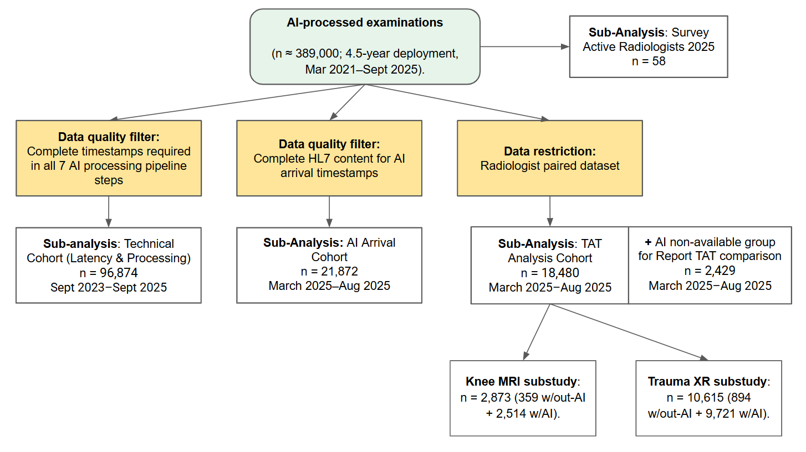

<!-- Accepted manuscript, author distribution copy. © 2026 American College of Radiology. This manuscript version is made available under the CC-BY-NC-ND 4.0 license https://creativecommons.org/licenses/by-nc-nd/4.0/ Final version: https://doi.org/10.1016/j.jacr.2026.09.026 -->

Accepted manuscript · Author distribution copy

# AI Latency, Report Turnaround Time, and Adoption in a Multi-Vendor AI Ecosystem: A Multi-Site Observational Study

- Sergey Morozov1, General Manager
- Natalie Heracleous2, Senior Researcher
- Octave Novarina2, AI engineer
- Diana Korka2, Data analyst
- Benoît Dufour2, Workflow manager
- Cyril Thouly2, COO
- Benoît Rizk2, CMIO and radiologist

1 Medlogic, Brussels, Belgium 
2 3R Swiss Imaging Network, Sion, Switzerland

**Corresponding author:** Sergey Morozov, Medlogic, Brussels, Belgium. dr.morozov.sergey@gmail.com

## About this version

**Status**

This is the accepted manuscript (the authors' version after peer review, before copy-editing and typesetting) of an article published in the Journal of the American College of Radiology. The final version is available at: <https://doi.org/10.1016/j.jacr.2026.09.026>

**How to cite**

Morozov S, Heracleous N, Novarina O, Korka D, Dufour B, Thouly C, Rizk B. AI Latency, Report Turnaround Time, and Adoption in a Multi-Vendor AI Ecosystem: A Multi-Site Observational Study. J Am Coll Radiol. 2026. doi:10.1016/j.jacr.2026.09.026 
BibTeX: <https://aimonitoring.drsergeymorozov.com/cite/citation.bib> 
RIS: <https://aimonitoring.drsergeymorozov.com/cite/citation.ris> 
Images for talks and posts: <https://aimonitoring.drsergeymorozov.com/#images>

**Licence**

© 2026 American College of Radiology. This manuscript version is made available under the CC-BY-NC-ND 4.0 license <https://creativecommons.org/licenses/by-nc-nd/4.0/>

**Corrections**

Corrections notified to the publisher for the proofs have been applied to this version: author order, funding entry in STROBE item 22, number of AI tools in the technical cohort and in Table 1B, vendor names in eTable 1. This copy was laid out by the authors for personal distribution. Its layout does not reproduce the journal version; please cite the published article.

**Links**

Research page: <https://aimonitoring.drsergeymorozov.com> 
3R Swiss Imaging Network: <https://www.groupe3r.ch>

## Author information

**Data Statement**

The authors declare that they had full access to all of the data in this study and the authors take complete responsibility for the integrity of the data and the accuracy of the data analysis. All authors approved the final manuscript and agree to be accountable for all aspects of the work.

**Author contributions**

Sergey Morozov: conceptualization, methodology, data curation, formal analysis, writing – original draft, writing – review & editing, project administration. Natalie Heracleous: data curation, investigation, formal analysis, writing – review & editing. Octave Novarina: investigation, formal analysis, writing – review & editing. Diana Korka: data curation, investigation, writing – review & editing. Benoît Dufour: resources (operations), project administration, data curation, writing – review & editing. Cyril Thouly: resources (IT infrastructure), data curation, funding acquisition, project administration, writing – review & editing. Benoît Rizk: conceptualization, supervision, project administration, writing – review & editing.

**Funding**

Guerbet AG provided research donation, Incepto Medical provided Keros software free of charge.

**Conflict of Interest**

3R Swiss Imaging Network holds royalties for the Keros Knee MRI AI product, developed and distributed by Incepto Medical. The study's primary finding involves a product (Gleamer BoneView) manufactured by a company in which a co-author (B.R.) holds equity. To mitigate bias, data extraction and statistical analysis were performed by S.M., N.H., O.N., who have no financial relationship with Gleamer. S.M. reports an ongoing paid services/consulting relationship with 3R Swiss Imaging Network via Medlogic; S.M. is not an employee of 3R.

**Acknowledgements**

Radiologists: Roger Aebi, Marcelo Aguilar, Mourad Amor, Marcela Anchanté, Anne-Catherine Bafort, Anastasia Barras, Hachem Ben Bouzid, Pierre Benedict, Olivier Berrebi, Iheb Bougamra, Johann Carrard, Anna Caruso, Theofilos Christoforidis, Monica Deac, René De Gautard, Sofiane Derrouis, Amira Dhouib, Daniela Duarte Moreira, Luca Duc, Victor Fernandes, Pierre-Jacques Fournier, Julien Galley, Matteo Gandalini, Marc Giraud, Cécile Grandin, Arnaud Grégoire, Enrico Guidetti, Catrina Hansen-Pham, Maria Kebets, Peter Kelemen, Romain Kohler, Amine Korchi, Georges Krompecher, Vincent Lenoir, Gibran Manasseh, Marc Mazilu, Benoît Morel, Patricia Nin, Mehmet Öksüz, Laurence Omarini, Kahina Ouamer, Alain Pellaton, Jacques Perrin, Bahar Popal, Miriam Pyka, Diana Ribeiro, Anna-Maria Rosano, Diego San Millán, Patrique Santos Oliveira, Abdulhakim Sarraj, Anne Laure Saverot, Caroline Schutz Schweizer, Georgios Sgourdos, Jean-Marc Steity, Aphrodite Syrogiannopoulou, Catherine Waeber, Lorena Zamora; IT support: Philippe Ballestraz, Frank Derosier, Nicolas Rabiller, Thomas Vincendon. Special thanks to Simon Pericou, Dominique Fournier, Michael Rentmeister, Hugues Brat, and Federica Zanca.

## Abstract

**Objective:** To evaluate infrastructure latency, workflow, and radiologist sentiment across a 4.5-year, multi-vendor AI implementation program in a 20-center outpatient radiology network.

**Methods:** Three retrospective cohorts: a technical cohort (96,874 examinations; Sep 2023–Sep 2025) for PACS-to-PACS latency and temporal alignment of 9 of 10 deployed AI tools from 7 vendors; a report turnaround time (TAT) analysis cohort (20,909 examinations; Mar–Aug 2025) comparing TAT between AI-available and concurrent non-AI workflows by Mann-Whitney U; and a survey cohort (58 radiologists; two waves 2025) for adoption, Likert-scale perceptions, and Net Promoter Score (NPS).

**Results:** Active AI adoption was 91.4% (53/58), with 66% (35/53) reporting regular use. Median total latency was 2.06 minutes [interquartile range 1.74-3.05], 72% of which attributable to data routing. The "Too Late" rate (AI result arriving after report finalization) was 7.2% overall, ranging from 3.0% for knee MRI to 13.2% for chest CT. After adjustment for radiologist (linear mixed-effects models), AI availability was associated with lower median TAT for trauma radiography (-26%) and knee MRI (-18%; both p<0.001); brain volumetry MRI showed no significant change (+9.2%; p=0.33). In exploratory analysis, NPS declined for chest CT (+38 to −3) and aorta CT (+22 to −25), nominally significant before multiple-comparison correction.

**Discussion:** Multi-vendor AI at scale was associated with measurable TAT gains in high-volume modalities. Infrastructure latency, not algorithm speed, was the primary barrier to clinical utility. At ~23–25% annualized cost of one radiologist full-time equivalent (FTE) salary, the program generated 0.69 FTE of capacity through trauma radiography alone (0.46 FTE after radiologist-adjusted sensitivity analysis).

**Keywords:** Artificial intelligence, Workflow efficiency, Latency, Adoption, Real-world evidence.

**Summary sentence:** A 4.5-year, 20-center implementation achieved 91% adoption and 26% trauma radiography TAT reduction through workflow-integrated deployment; infrastructure latency – not algorithm speed – is the primary barrier to AI clinical utility.

## Take home points

1. Widespread AI adoption (91.4%) in private practice was associated with statistically significant TAT reductions: 40% (radiologist-adjusted: 26%) for trauma radiography and 30% (adjusted: 18%) for knee MRI.
2. Operational analysis revealed that 72% of total latency was attributable to data routing rather than algorithm inference, causing AI results to arrive after report finalization in 7.2% of overall exams.
3. Despite objective TAT reductions, perceived productivity remained below neutral (Likert 2.94/5.0), suggesting an efficiency-absorption pattern.
4. The annualized AI platform cost corresponded to 23–25% of one radiologist FTE salary while generating an estimated 0.69 FTE of capacity (0.46 FTE adjusted) from trauma radiography alone, yielding a ~3:1 ROI (~2:1 adjusted) for high-volume applications.

## Introduction

Facing radiologist shortages and rising imaging demand (8% growth in CT/MRI vs. 4.7% workforce increase, projecting a 39% shortfall by 2029),1,2 many radiology groups have increasingly adopted computational pattern-recognition tools.3–6 AI use is accelerating but uneven: a 2024 survey reported 47.9% active users (up from 20% in 2018), and 2025 French academic settings saw 80% adoption.7–9 In contrast, US systems cite immature tools and financial barriers.10 While radiologists value AI as a "safety net" for subtle findings, most users report no significant workload reduction.11

AI's potential to enhance efficiency has been demonstrated in narrow contexts. For instance, AI-driven worklist triage reduces report turnaround time (TAT) for acute findings like pulmonary embolism by 20% to 32% during peak hours.12 Emerging research on Generative AI and Large Language Models (LLM) for draft reporting suggests 15.5% to 24% gains in documentation efficiency without compromising accuracy.13–16 However, these benefits are highly variable; some studies show that AI paradoxically increases reading times for complex cases or causes "alert fatigue" from false flags on normal exams.17–19

The real-world impact of technical infrastructure on clinical utility is poorly documented.18,19 While multinational studies have explored monitoring and algorithm helpfulness,20 large-scale evidence on multi-vendor orchestration and infrastructure latency remains scarce and a recent comprehensive review confirmed that most AI workflow studies remain single-site with short observation windows and intermediate process measures.21 The major gap is the "Last Mile" problem: how processing delays erode AI value in acute settings, irrespective of algorithmic accuracy.22,23

This study quantifies PACS-to-PACS latency and the temporal alignment of AI results with report finalization across ~389,000 AI-assisted examinations, with detailed latency analysis on a quality-controlled subset of ~97,000 cases; compares report turnaround time between AI-available and concurrent non-AI workflows; and evaluates adoption and perceived value in a two-wave survey of the Network's 58 radiologists.

## Methods

**Study Design and Ethical Approval** This retrospective observational study was conducted across a 20-center outpatient radiology network in the French-speaking area, operating under single private ownership. The 20 centers were grouped into 13 clusters. Sites were assigned to the same cluster when they are located in close geographic proximity and are staffed by the same radiologists, who rotate between them and work from a partly shared worklist. Clustering reflects staffing and workflow adjacency, not examination volume. The Network deploys approximately 50 imaging systems (25 CT and 25 MRI) and employs 58 board-certified radiologists, who interpret examinations across multiple sites within their assigned clusters. Reporting follows the STROBE statement for observational studies; the completed checklist is provided as Supplementary Material.

The Network processed approximately 389,000 AI-assisted examinations over the 4.5-year deployment; detailed participant flow, completion rates, and exclusions are reported in Results and Figure 1. Earlier implementation phases lacked standardized DICOM/HL7 logging; the Technical Cohort therefore covers only the mature infrastructure period (2023–2025), where all pipeline steps were consistently recorded.

The retrospective analysis of de-identified operational log data was conducted under an institutional data governance waiver, with no direct patient contact, no intervention, and no access to identifiable health records. All patients provided digital informed consent upon admission permitting de-identified data use for cloud AI processing and for research; patients could opt out. The study adhered to the Declaration of Helsinki and complied with GDPR and Swiss FADP.

Participation in the radiologist survey was voluntary and confidential; survey completion constituted implied consent. Responses were pseudonymized for the research analysis and no identifying information was retained in the analytical dataset. As a staff survey on working tools without health-related or patient data, it fell outside the Swiss Human Research Act (Art. 2) and required no ethics-committee review.

**Study Population** Three datasets correspond to the technical and human components (Figure 1). Technical Cohort: 96,874 consecutive examinations (Sep 2023–Sep 2025) with complete DICOM/HL7 timestamp chains. TAT Analysis Cohort: 20,909 examinations (Mar–Aug 2025), restricted to radiologists present in both AI-processed and non-AI groups (paired datasets) to estimate AI vs non-AI differences. Survey Cohort: 58 board-certified radiologists active at the Network's 20 centers.

No a priori sample size calculation was performed; all consecutive eligible examinations during the study period were included.

Race and ethnicity data were not collected; the study analyzed operational workflow metrics for which these were not hypothesized to be relevant covariates, and Swiss federal law (FADP/nDSG Art. 5(c)) restricts processing of racial/ethnic data without explicit justification. The study population reflects the demographic profile of patients presenting to an outpatient radiology network in the French-speaking Swiss metropolitan area. Radiologist race/ethnicity were similarly not collected.

**AI Tool and Implementation** Ten CE-certified AI applications from seven vendors were integrated via a commercial orchestrator (Incepto Medical, France) or directly. Tools spanned detection, quantification, and segmentation; full vendor and modality details in eTable 1.

AI analysis was triggered automatically, without action by the radiologist, to minimize radiologist manual interaction and ensure consistent availability. Upon image acquisition, DICOM studies were automatically routed from the modality to the cloud-based AI platform via a secure gateway.

**Data Collection and Measurements** Data collection was divided into technical workflow metrics and user feedback. For the technical analysis, timestamps were automatically logged at multiple checkpoints for every examination using DICOM tags, AI processing metrics and HL7 ORM (Order Message) status messages to calculate latency and Report TAT. Total Latency (T_total = t_RIS_available − t_study_end) was decomposed into routing time (fetching + upload + download) and inference time (AI processing). Routing share was calculated as the proportion of mean routing time relative to mean total latency.

Report turnaround time (TAT) was defined as t_report_finalized minus t_report_created, taken from the same HL7 message stream. The "Too Late" rate was the percentage of cases where the HL7 report-validation timestamp ('Finalized') preceded AI result availability; it quantifies infrastructure-imposed temporal loss, not radiologist engagement.

A 23-item questionnaire (eTable 2) was administered to all 58 radiologists in May-June 2025 (wave 1) and October-November 2025 (wave 2), assessing usage frequency, Likert-scale perceptions (Trust, Quality, Productivity; 1–5), confidence sharing results, and product-specific Net Promoter Score (NPS).24

**Statistical Analysis** Statistical analysis used Python 3.12 with SciPy and statsmodels.25 Continuous variables were reported as means with SD or medians with interquartile range (IQR). TAT was compared between AI-assisted and concurrent non-AI workflows in the 2025 subset (non-AI = consent refusal or technical failure) using Mann-Whitney U tests; the non-AI group may differ systematically from AI-available cases in age, acuity, and complexity. To account for radiologist-level clustering, we additionally fitted a linear mixed-effects model on log-transformed TAT, with a random intercept for radiologist and a fixed effect for AI availability. These models included the 55 radiologists who contributed examinations to both conditions. Between-wave comparisons at group level included all respondents to each wave and used Mann-Whitney U tests for NPS and Likert perception scores and Fisher's exact test for usage frequency; because these samples partly overlap, they were complemented by paired analyses restricted to the radiologists who responded to both waves, using Wilcoxon signed-rank tests for usage frequency, Likert items and per-tool ratings. Associations with professional experience were assessed by Spearman correlation across all respondents, with per-radiologist measures averaged across the two waves (per-tool ratings: eTable 5 footnote). Survey analyses were exploratory; no multiplicity correction was applied. A pre-specified within-cohort stability check computed quarterly median total latency per AI solution; per-solution coefficient of variation (CV) and observed latency patterns are reported in eTable 3. Two-sided p<0.05 was considered significant.

Two primary endpoints were pre-specified: median report TAT for trauma radiography (BoneView; high-volume detection) and knee MRI (Keros; complex segmentation). Exploratory secondary endpoints comprised TAT for the eight non-primary modalities (Table 3) and survey-derived metrics (per-tool NPS, Likert perception scores and usage frequencies). Patient age, sex, modality and site cluster were identified a priori as potential confounders; they were not included as covariates because the mixed-effects model was specified to address radiologist-level clustering rather than case-mix adjustment, and residual confounding by these variables is discussed in Limitations. Pre-specified subgroup analyses included TAT by modality (Table 3), TAT by site cluster (eTable 4), and survey metrics by experience level (eTable 5); no formal interaction tests were performed. In a sensitivity analysis, the trauma XR TAT comparison was restricted to adults 18 to 64 years old to reduce age-related confounding. The conclusion of each report was additionally classified by a rule-based text classifier as absent, equivocal or present for the conditions within the intended use of the AI solution used for that examination type, validated against blind radiologist reading (eTable 6).

## Results

### Study Cohort and Demographics

Figure 1. Study design and flowchart of data selection for technical, clinical, and qualitative analyses.

Table 1. Demographics and examinations’ characteristics of the TAT Analysis Cohort (with AI vs. without AI).

| **Characteristic** | **With AI** | **Without AI** | **p-value** |
| --- | --- | --- | --- |
| Sample size | 18,480 | 2,429 |  |
| Age (years), mean ± SD | 49.9 ± 21.9 | 55.3 ± 19.8 | <0.001 |
| 0-17 years, n (%) | 2,116 (95.0) | 111 (5.0) |  |
| 18-44 years, n (%) | 4,827 (89.1) | 589 (10.9) |  |
| 45-64 years, n (%) | 6,330 (87.5) | 903 (12.5) |  |
| ≥65 years, n (%) | 5,207 (86.3) | 826 (13.7) |  |
| Female sex, n (%) | 10,478 (56.7) | 1,492 (61.1) | <0.001 |
| CT, n (%) | 2,316 (88.5) | 302 (11.5) | <0.001 |
| DX, n (%) | 12,052 (89.4) | 1,424 (10.6) |  |
| MG, n (%) | 1,352 (88.5) | 176 (11.5) |  |
| MR, n (%) | 2,760 (84.0) | 527 (16.0) |  |
| Clinical condition reported on the index examinationᵃ, n/N (%) |  |  |  |
| Fracture, dislocation, avulsion or joint effusion (skeletal radiography) | 3,026/9,721 (31.1) | 198/894 (22.1) |  |
| Pulmonary opacity, nodule, pleural effusion, pneumothorax, atelectasis or cardiomegaly (chest radiography) | 457/1,714 (26.7) | 61/261 (23.4) |  |
| Meniscal, ligament, cartilage or bone lesion (knee MRI) | 2,198/2,514 (87.4) | 327/359 (91.1) |  |
| Pulmonary nodule or mass (chest CT) | 752/2,283 (32.9) | 91/289 (31.5) |  |
| Aortic aneurysm or dissection (CT angiography) | 15/33 (45.5) | 4/13 (30.8) |  |
| BI-RADS 0 or 3 to 6 (mammography) | 130/1,352 (9.6) | 21/176 (11.9) |  |
| Measurement-only examinations (bone age, bone metrics, brain volumetry, white-matter lesion segmentation)ᵇ | 863 (n/a) | 437 (n/a) |  |
| Number of sites | 13 | 13 |  |
| Study period | Mar 2025 - Aug 2025 | Mar 2025 - Aug 2025 |  |

ᵃ Condition within the intended use of the AI solution used for that examination type, reported as present or equivocal in the conclusion of the radiologist report; rule-based text classification validated against blind radiologist reading; group comparisons in eTable 6. N = examinations of that type in the group. ᵇ Quantitative tools only; no binary condition, not classified.

Table 1B. Radiologist demographics

| **Characteristic** | **Value, n (%)** |
| --- | --- |
| **Total radiologists in the Network** | **58 (HR records)** |
| **Sex***(HR records, N=58)* |  |
| Male | 36 (62.1%) |
| Female | 22 (37.9%) |
| **Years of post-training experience***(Survey analytic sample, N=55)* |  |
| 3–5 years (early-career) | 9 (16.4%) |
| 6–15 years (mid-career) | 23 (41.8%) |
| ≥15 years (senior) | 23 (41.8%) |
| **Primary subspecialty***(N=55)* |  |
| Musculoskeletal | 14 (25.5%) |
| Neuroradiology | 16 (29.1%) |
| General radiology | 9 (16.4%) |
| Thoracic | 9 (16.4%) |
| Abdominal | 4 (7.3%) |
| Cardiovascular | 1 (1.8%) |
| Pediatric | 2 (3.6%) |
| **Practice pattern***(N=55)* |  |
| Subspecialist (≥1 declared subspecialty) | 46 (83.6%) |
| Generalist (no subspecialty) | 9 (16.4%) |
| **AI tool breadth, of 11 rated items (10 AI applications + AI platform services) (N=55)** |  |
| Median (IQR) | 6 (5–8) |
| Mean ± SD | 6.3 ± 2.8 |
| Range | 0–11 |
| **AI use frequency (latest reported wave)***(N=55)* |  |
| Always | 10 (18.2%) |
| Often | 27 (49.1%) |
| Sometimes | 16 (29.1%) |
| Rarely | 2 (3.6%) |
| **Survey wave participation***(N=55 unique respondents)* |  |
| Both waves | 50 (90.9%) |
| Wave 1 only | 3 (5.5%) |
| Wave 2 only | 2 (3.6%) |

Sex extracted from HR records (N=58 board-certified radiologists). Other characteristics reported for the survey analytic sample (N=55 respondents; values from each respondent’s latest completed wave). Radiologist race/ethnicity were not collected per Swiss FADP/nDSG Art. 5(c) restrictions and were not hypothesized to influence operational workflow metrics. Per-radiologist case-reading volume is not reported because workload varies substantially across modalities, schedule density, subspecialty allocation, and the 4.5-year deployment window. AI tool breadth is provided as proxy.

The Network processed ~389,000 AI examinations over 4.5 years (Figure 1); 53 of 58 radiologists (91.4%) responded to the first survey wave and 52 of 58 (89.7%) to the second; 50 responded to both waves. Detailed radiologist demographics are in Table 1B: 58 board-certified radiologists (62% male, 38% female by HR records); 84% subspecialists (musculoskeletal and neuroradiology most common); median AI tool breadth 6 of 11 rated items (10 AI applications + AI platform services); 67% reporting "often" or "always" use. A listed condition was reported as present or equivocal in 37.1% (7,280/19,609) of classified examinations (Table 1, eTable 6).

Missing data rates for key variables: latency timestamps available for 96,874/~389,000 examinations (24.9%); TAT available for 20,909/20,909 (100%); survey completion 53/58 (91.4%) in wave 1 and 52/58 (89.7%) in wave 2.

**Technical Performance and Latency Analysis (Longitudinal Data)** Median Total Latency was 2.06 minutes [IQR:1.74-3.05] (eFigure 1), with 72% attributable to data routing (eFigure 2). Fetching the study from PACS was the single largest latency component in five of nine solutions (22% to 61% of total time). AI inference time varied substantially by modality (from 0.21 min for XR to 6.61 min for brain MRI); the volume-weighted global median was 0.22 [IQR: 0.21-0.37] minutes (Table 2).

A pre-specified within-cohort stability check (eTable 3) showed steady-state processing latency for five of nine AI solutions. Four exhibited distinct patterns, progressive latency drift, post-deployment convergence, and a temporal infrastructure incident with full recovery, identifying targets for continuous monitoring rather than algorithm-level confounding.

The global "Too Late" rate was 7.2%, varying markedly by modality: 13.2% for chest CT, 6.8% for trauma X-ray, and 3.0% for knee MRI (Figure 2). Cross-sectional imaging (CT/MRI, n=5,246) arrived during or after report finalization more often than radiography (29.6% [1,554/5,246] vs. 13.6% [2,079/15,260], p<0.001).

**Impact on Report TAT (2025 Subset)** Median trauma XR TAT decreased from 5.0 to 3.0 min (40% unadjusted, 26.3% radiologist-adjusted; p<0.001; sensitivity analysis in adults 18–64: 4.0 → 3.0 min, 25%; p<0.001). Applied to the 45,561 trauma radiographs processed by BoneView in 2025, the unadjusted 2-minute median difference corresponds to 0.69 full-time equivalent (FTE) of annual reporting capacity (0.46 FTE using the radiologist-adjusted 1.32-minute difference), at an annual platform cost equivalent to 23-25% of one radiologist FTE salary. Median knee MRI TAT decreased from 20.0 to 14.0 min (30% unadjusted, 17.7% adjusted; p<0.001). Brain volumetry MRI showed no significant change (+9.2%; p=0.33; n=345). Aorta CT estimates should be interpreted cautiously (n=13 without-AI).

### Adoption Rates and User Sentiment

Per-survey-wave perception metrics are summarized in Table 4. The only statistically significant Likert change was perceived productivity gain (2.57 → 2.94; p=0.014), which remained below the neutral midpoint. Tool rating declined modestly (7.62 → 7.28; p=0.001), and aggregate NPS fell from +14.3% to +3.5% (p=0.141).

The survey revealed that 53 out of 58 radiologists (91.4%) responded to the first wave, all of whom were active users of at least one AI tool. Because the questionnaire offered no non-use option, non-use was ascertained by individual interview of the non-respondents. In exploratory NPS analysis, Chest CT showed nominally significant decline (38 → −3, p=0.043, uncorrected) and Aorta CT (22 → −25, p=0.048, uncorrected) (Table 5).

Professional experience was associated with AI usage patterns (N=55). Mid-career radiologists (6–15 years) had the highest regular use rate (17/23, 73.9%), followed by senior (15/23, 65.2%) and early-career radiologists (2/9, 22.2%; χ²=7.52, p=0.023). Perceived productivity correlated inversely with experience (Spearman ρ=−0.32, 95% CI −0.54 to −0.06, p=0.018), with early-career radiologists reporting the highest perceived gains (mean 3.44 vs. 2.46 for seniors). Experience showed no significant association with trust, quality perception, or tool satisfaction (eTable 5).

![Figure 2. Temporal alignment of AI result delivery relative to Radiology Report creation and finalization (the "Too Late" metric), by modality. Bars show the percentage of examinations in which the AI result arrived before report creation, during report dictation and editing, or after report finalization ("Too Late"). Modalities ordered by the share of AI results arriving before report creation. Denominator: examinations with a linked report timestamp (n per modality shown; 21,872 in total); pooled values in Table 2.](assets/figures/figure-2.webp)

Figure 2. Temporal alignment of AI result delivery relative to Radiology Report creation and finalization (the "Too Late" metric), by modality. Bars show the percentage of examinations in which the AI result arrived before report creation, during report dictation and editing, or after report finalization ("Too Late"). Modalities ordered by the share of AI results arriving before report creation. Denominator: examinations with a linked report timestamp (n per modality shown; 21,872 in total); pooled values in Table 2.

Table 2. Technical Performance of AI Implementation: Latency, 'Too Late' Rates, and Workflow Impact by Modality

| **Modality / AI Tool** | **Total Latency (Median [Q1-Q3]), min** | **Data Transfer Time (fetching, upload and download), ratio of means (%)** | **AI processing time, (Median [Q1-Q3]) min** | **Sample size – Technical Cohort** | **Before report creation, n/N (%)** | **During report dictation and editing*, n/N (%)** | **After Report Finalization, "Too Late" Rate, n/N (%)** |
| --- | --- | --- | --- | --- | --- | --- | --- |
| Bone age X-ray | - | - | - | - | 328/337 (97.3%) | 3/337 (0.9%) | 6/337 (1.8%) |
| Trauma X-Ray | 1.81 [1.68-2.07] | 1.75/1.96 (89.3%) | 0.21 [0.20-0.22] | 60,769 | 9,400/10,812 (86.9%) | 673/10,812 (6.2%) | 739/10,812 (6.8%) |
| MSK measurements X-ray | 2.56 [1.84-3.23] | 2.36/2.59 (91.1%) | 0.22 [0.21-0.24] | 9,279 | 1,813/2,168 (83.6%) | 178/2,168 (8.2%) | 177/2,168 (8.2%) |
| Chest XR | 2.57 [2.57-2.58] | 2.25/2.58 (87.2%) | 0.32 [0.31-0.35] | 1,982 | 1,640/1,943 (84.4%) | 166/1,943 (8.5%) | 137/1,943 (7.1%) |
| Mammography | 3.40 [2.88-3.91] | 2.53/3.41 (74.2%) | 0.90 [0.50-1.25] | 5,324 | 752/1,366 (55.1%) | 509/1,366 (37.3%) | 105/1,366 (7.7%) |
| Chest CT Lung Nodules | 13.10 [9.77-17.79] | 7.84/14.17 (55.3%) | 5.47 [3.96-8.03] | 4,406 | 1,253/2,314 (54.1%) | 755/2,314 (32.6%) | 306/2,314 (13.2%) |
| Aorta CT | 8.26 [6.79-10.61] | 5.86/8.80 (66.6%) | 2.87 [2.56-3.41] | 378 | 48/76 (63.2%) | 22/76 (28.9%) | 6/76 (7.9%) |
| Multiple sclerosis MRI | 13.04 [10.82-15.48] | 6.68/13.29 (50.3%) | 6.22 [5.46-7.89] | 1,045 | 92/145 (63.4%) | 36/145 (24.8%) | 17/145 (11.7%) |
| Brain volumetry MRI | 10.30 [8.97-12.05] | 3.88/10.56 (36.7%) | 6.61 [5.89-7.60] | 987 | 129/188 (68.6%) | 43/188 (22.9%) | 16/188 (8.5%) |
| Knee MRI | 3.46 [2.91-3.69] | 1.84/3.36 (54.8%) | 1.72 [1.11-1.80] | 12,704 | 2,170/2,523 (86.0%) | 278/2,523 (11.0%) | 75/2,523 (3.0%) |
| Global Median | 2.06 [1.74-3.05] | 2.24/3.09 (72.5%) | 0.22 [0.21-0.37] | 96,874 | 17,625/21,872 (80.6%) | 2,663/21,872 (12.2%) | 1,584/21,872 (7.2%) |

\* AI result arrived between report creation and report finalization. Timing categories (last three columns) are computed on examinations with a linked HL7 report timestamp (N per modality; 21,872 in total); the Technical Cohort column gives all examinations with complete latency timestamps.

Table 3. Impact of AI Implementation on Radiologist Report TAT by Modality

| **Modality** | **Median TAT w/out AI, min [Q1-Q3]** | **Number of exams w/out AI** | **Median TAT w/ AI, min [Q1-Q3]** | **Number of exams w/ AI** | **TAT change (unadjusted):difference of medians; % reduction** | **TAT change (adjusted): Mixed Linear Model; % reduction** | **Statistical Significance (unadjusted; p, Mann-Whitney)** | **Statistical Significance (adjusted; p, mixed model)** | **Radiologists in mixed model, n** |
| --- | --- | --- | --- | --- | --- | --- | --- | --- | --- |
| Bone age X-ray | 2.0 [0.5-4.0] | 107 | 1.0 [1.0-2.0] | 328 | -50.0% | -79.2% | < 0.001 | < 0.001 | 2 |
| Trauma X-Ray | 5.0 [2.0-14.8] | 894 | 3.0 [1.0-6.0] | 9,721 | -40.0% | -26.3% | < 0.001 | < 0.001 | 50 |
| MSK measurements X-ray | 6.0 [3.0-20.0] | 727 | 4.0 [2.0-12.0] | 2,007 | -33.3% | -12.4% | < 0.001 | < 0.001 | 50 |
| Chest XR | 4.0 [1.0-8.0] | 261 | 2.0 [1.0-5.0] | 1,714 | -50.0% | -17.7% | < 0.001 | < 0.001 | 40 |
| Mammography | 24.5 [14.8-49.2] | 176 | 19.0 [11.0-35.0] | 1,352 | -22.4% | -18.2% | < 0.001 | < 0.001 | 23 |
| Chest CT Lung Nodules | 31.0 [17.0-59.0] | 289 | 27.0 [15.0-49.0] | 2,283 | -12.9% | -13.5% | < 0.001 | 0.002 | 38 |
| Aorta CT | 42.0 [31.0-69.0] | 13 | 40.0 [18.0-51.0] | 33 | -4.8% | -18.8% | 0.335 | 0.369 | 7 |
| Multiple sclerosis MRI | 26.0 [12.0-57.0] | 162 | 32.0 [15.0-50.0] | 145 | +23.1% | +8.0% | 0.914 | 0.418 | 15 |
| Brain volumetry MRI | 26.0 [12.0-57.0] | 160 | 36.0 [20.0-55.0] | 185 | +38.5% | +9.2% | 0.080 | 0.327 | 15 |
| Knee MRI | 20.0 [10.0-33.0] | 359 | 14.0 [7.0-26.0] | 2,514 | -30.0% | -17.7% | < 0.001 | < 0.001 | 39 |
| Row totals (3,148 without-AI; 20,291 with-AI; 23,439 total) exceed the TAT Analysis Cohort total (20,909 unique examinations) because individual plain radiography examinations could trigger multiple AI applications simultaneously, e.g. BoneView for fracture detection and BoneMetrics for measurements. Each AI tool's TAT was analyzed independently. Table 1 reports unique examinations by the DICOM modality group. For BoneAge, the without-AI group (n=107) includes examinations from sites or periods prior to tool activation; this comparison is therefore pre-/post-deployment rather than concurrent. Unadjusted = relative median difference; adjusted = 100 × (exp(β₁) − 1) from a log-linear mixed-effects model. The two estimators are not directly comparable. Overall, 55 radiologists contributed examinations to at least one model. |  |  |  |  |  |  |  |  |  |

Table 4. Comparison of Radiologist AI Usage Habits and Perceived Value Metrics (two waves; 53 and 52 respondents)

| **Metric** | **Wave 1** | **Wave 2** | **Δ** | **p-value** |
| --- | --- | --- | --- | --- |
| **Usage Frequency** | *(N=53)* | *(N=52)* |  |  |
| Always use | 11 (20.8%) | 9 (17.3%) | −3.5 pp | 0.729 |
| Often use | 24 (45.3%) | 26 (50.0%) | +4.7 pp | 0.729 |
| Sometimes use | 15 (28.3%) | 16 (30.8%) | +2.5 pp | 0.729 |
| Rarely use | 3 (5.7%) | 1 (1.9%) | −3.7 pp | 0.729 |
| Regular users (Always+Often) | 35 (66.0%) | 35 (67.3%) | +1.3 pp | 1.000 |
| **Perception Metrics (1–5)** |  |  |  |  |
| Trust in AI | 3.28 | 3.27 | −0.01 | 0.467 |
| Quality improvement perception | 3.40 | 3.35 | −0.05 | 0.841 |
| Productivity gain perception | 2.57 | 2.94 | +0.38 | 0.014 |
| Confidence sharing AI results with referring physicians | 2.98 | 2.85 | −0.13 | 0.407 |
| Concern about over-dependence on AI | 2.77 | 2.87 | +0.09 | 0.503 |
| **Tool Performance** |  |  |  |  |
| Tool rating mean (0–10) | 7.62 | 7.28 | −0.33 | 0.001 |
| Aggregate NPS (0-10) | +14.3% | +3.5% | −10.9 pp | 0.141 |

Table 5. NPS Score Comparison and Statistical Significance of change from May-June 2025 (wave 1) to October-November 2025 (wave 2).

| **AI Solution** | **NPS Wave 1** | **Total N in Wave 1** | **NPS Wave 2** | **Total N in Wave 2** | **Change between waves** | **P-Value *** |
| --- | --- | --- | --- | --- | --- | --- |
| Bone age X-ray | 87 | 30 | 86 | 29 | -1 | 0.063 |
| MSK measurements X-ray | 65 | 46 | 66 | 44 | 1 | 0.184 |
| Trauma X-Ray | 27 | 48 | 30 | 47 | 3 | 0.867 |
| Multiple sclerosis MRI | 24 | 25 | 13 | 23 | -11 | 0.567 |
| Mammography | 11 | 28 | 7 | 29 | -4 | 0.654 |
| Chest CT Lung nodules | 38 | 39 | -3 | 39 | -41 | 0.043 |
| Aorta CT | 22 | 23 | -25 | 24 | -47 | 0.048 |
| Knee MRI | -33 | 39 | -26 | 39 | 7 | 0.820 |
| Brain volumetry MRI | -17 | 23 | -28 | 25 | -11 | 0.254 |
| Chest XR | -39 | 44 | -47 | 43 | -8 | 0.751 |
| AI Platform Services | -44 | 25 | -47 | 34 | -3 | 0.913 |

\* All p-values are uncorrected. Bonferroni-corrected threshold for 21 comparisons: p < 0.0024; no individual change reached this threshold.

## Discussion

**Main Findings** With a 91.4% active adoption rate among radiologists, AI tools deployed across multiple imaging modalities were associated with statistically significant TAT reductions in high-volume workflows, including trauma radiography (−26% TAT) and knee MRI (−18% TAT). The observational design and selection bias in the non-AI comparison group (defined by consent refusal and technical failures, not random assignment) preclude causal attribution; these findings are addressed in Limitations.

### Report TAT and Workforce Capacity

The estimated 0.69 FTE annual capacity associated with BoneView (45,561 exams × 2 min saved / 60 / 2,200 gross hours) at 23–25% of one radiologist FTE salary yields an approximate 3:1 ROI; a mixed-effects sensitivity analysis accounting for radiologist clustering yielded an attenuated 0.46 FTE / ~2:1 ROI, confirming a positive return after methodological correction. Per-site this equates to ≈0.03–0.05 FTE, but the AI subscription is network-level – so network-level ROI is the appropriate economic unit. This estimate assumes the 2-minute TAT difference is fully attributable to AI availability and does not adjust for case complexity or self-selection. This aligns with Bharadwaj et al.'s modeled 451% five-year ROI for a stroke-focused AI platform.26

This success is stratified by modality and contingent upon robust infrastructure, consistent with a 140-study systematic review reporting mixed efficiency evidence.27 That 72% of total latency stems from data routing rather than algorithm inference shows that the barrier to clinical utility is delivery and workflow fit, not the algorithm itself.

A detailed knee MRI reading-time analysis in the same network showed AI disproportionately benefited generalist radiologists (−34%) over subspecialists (−18%), suggesting AI may partially compensate for subspecialty expertise gaps in mixed-practice settings.28 Observed TAT differences should be interpreted as associations, not causal effects, given the non-randomized comparison (see Limitations).

**Comparison with International Practices** The Network's implementation maturity exceeded reported benchmarks (eTable 7). In a 2025 French academic survey,9 80% of radiologists had AI available but 70% perceived no workload reduction; case mix plausibly explains part of the gap; within a given case mix, however, result-delivery latency remains the binding constraint, consistent with Dean et al.'s monitoring framework20.

### Implications for Implementation: a PDCA-Based Governance Framework

The lessons learned from this 4.5-year implementation experience suggest a PDCA-based governance framework: (Plan) Define Time-to-Display targets before implementation; (Do) Implement automated push architectures; (Check) Monitor latency, algorithm drift, and NPS quarterly; (Act) Decommission underperforming tools and upgrade routing. This framework aligns with emerging monitoring methodologies such as the Moscow Experiment's continuous testing protocol for 52 AI models.29 Besides, all AI applications in this study fall under the EU AI Act (Regulation 2024/1689) high-risk classification,30 which mandates post-market monitoring aligned with these principles.

### Technical Latency and the "Too Late" Metric

The 'Too Late' rate (7.2% globally, 13.2% for chest CT) quantifies infrastructure opportunity loss – AI results technically unavailable at report finalization – rather than confirmed clinical inefficiency. Because results are delivered automatically, even timely results are displayed passively; active engagement varies by radiologist confidence and workload pressure.31 The 13.2% thus represents a ceiling on potential inefficiency, not its actual magnitude. Although engagement analytics were not collected, radiologists routinely reference AI findings in reports and attach AI-generated key images.

### Radiologist Sentiment and the Specificity Pattern

The co-occurrence of minimal TAT improvement (13.5%) and declining NPS (38→−3) for Chest CT, against the backdrop of substantial TAT gains and stable NPS for Trauma XR, generates a hypothesis that in high-volume workflows false-positive burden may erode perceived efficiency gains even when diagnostic sensitivity is preserved. The Chest CT NPS decline may reflect false-positive burden, latency (13.1 min total, 13.2% Too Late), software version changes, or small per-tool samples (n=39); our data cannot disentangle these contributions, and the hypothesis requires prospective testing.

The disconnect between objective TAT reductions and subjective productivity perception (Table 4: Likert productivity 2.57–2.94, below the neutral midpoint, despite 26% and 18% measured TAT reductions) suggests an efficiency absorption pattern: time savings from AI-accelerated reporting may be immediately reinvested into additional case volume rather than experienced as workload relief.32 This disconnect may be modulated by experience (ρ=−0.32, p=0.018): early-career radiologists derive greater incremental benefit than seniors with established routines.

A 4.5-year, 20-center implementation achieved 91% adoption and 26% trauma radiography TAT reduction through workflow-integrated deployment; infrastructure latency – not algorithm speed – is the primary barrier to AI clinical utility.

## Limitations

This study has several limitations.

**Study design and external validity.** The analysis is retrospective and limited to a single privately managed European outpatient network, reducing generalizability to academic, inpatient, or non-European settings. Findings reflect one commercial orchestrator (Incepto Medical); alternative architectures may exhibit different latency profiles. The Network's royalty relationship with Keros may bias the knee MRI findings.

**Causal attribution.** The non-AI comparison group comprised only 2,429 of 20,909 examinations (11.6%), which limits precision. Group composition was determined by consent refusal and technical failure rather than random assignment, and case mix differed accordingly: patients processed with AI were younger and, for skeletal radiography, more often had a reported condition (Table 1), which would be expected to lengthen rather than shorten reporting. Adjustment for radiologist attenuated effect sizes but does not address patient-level confounding. Unmeasured variables (case complexity, time of day, dictation method) may also have influenced TAT.

**AI usage measurement.** Because AI results were delivered automatically rather than requested by the radiologist, our results capture efficiency under AI availability rather than confirmed tool usage; the 91.4% adoption rate mitigates but does not eliminate this gap. The "Too Late" metric presumes that radiologists would have engaged with timely AI output, which we cannot verify empirically.

**Statistical and demographic gaps.** Multiple unadjusted survey tests inflate Type I error risk; per-tool NPS over 4 months rests on modest samples. Per-radiologist sex was from HR records (N=58); race/ethnicity were not collected per Swiss FADP/nDSG. Per-radiologist reading volume was not used as a covariate because workload composition is not comparable across radiologists; AI tool breadth is reported instead.

## Declaration of generative AI and AI-assisted technologies in the writing process

During the preparation of this work the authors used Gemini 3 Pro and Claude Opus 4.6 in order to improve the clarity and quality of written communication. After using these tools, the authors reviewed and edited the content as needed and take full responsibility for the content of the publication.

## References

1. Royal College of Radiologists. *Clinical Radiology Workforce Census 2024*. Royal College of Radiologists; 2024. Published January 2024. Accessed March 2, 2026. <https://www.rcr.ac.uk/media/4imb5jge/_rcr-2024-clinical-radiology-workforce-census-report.pdf>

2. Halliday K. 2024 workforce census reports lay bare the challenges facing radiology and clinical oncology. Royal College of Radiologists. Published January 2024. Accessed March 2, 2026. <https://www.rcr.ac.uk/news-policy/latest-updates/2024-workforce-census-reports-lay-bare-the-challenges-facing-radiology-and-clinical-oncology/>

3. Hua D, Petrina N, Young N, Cho J, Poon S. Understanding the factors influencing acceptability of AI in medical imaging domains among healthcare professionals: A scoping review. *Artificial Intelligence in Medicine*. 11 2023;147:102698-102698. doi:[10.1016/j.artmed.2023.102698](http://dx.doi.org/10.1016/j.artmed.2023.102698)

4. Rawson JV, Smetherman D, Rubin E. Short-Term Strategies for Augmenting the National Radiologist Workforce. *American Journal of Roentgenology*. 04 2024;222. doi:[10.2214/ajr.24.30920](http://dx.doi.org/10.2214/ajr.24.30920)

5. Brink JA, Hricak H. Radiology 2040. *Radiology*. 12 2022;306:69-72. doi:[10.1148/radiol.222594](http://dx.doi.org/10.1148/radiol.222594)

6. Kalidindi S, Gandhi S. Workforce Crisis in Radiology in the UK and the Strategies to Deal With It: Is Artificial Intelligence the Saviour? *Cureus*. 08 2023;15. doi:[10.7759/cureus.43866](http://dx.doi.org/10.7759/cureus.43866)

7. European Society of Radiology. Current practical experience with artificial intelligence in clinical radiology: a survey of the European Society of Radiology. *Insights Imaging*. 06 2022;13. doi:[10.1186/s13244-022-01247-y](http://dx.doi.org/10.1186/s13244-022-01247-y)

8. Zanardo M, Visser JJ, Colarieti A, et al. Impact of AI on radiology: a EuroAIM/EuSoMII 2024 survey among members of the European Society of Radiology. *Insights Imaging*. 10 2024;15:240-240. doi:[10.1186/s13244-024-01801-w](http://dx.doi.org/10.1186/s13244-024-01801-w)

9. Machado L, Vilgrain V, Aubé C, Grégory J. La radiologie entre deux vagues : Adoption de l’intelligence artificielle dans les hôpitaux universitaires français en 2025. *J D Imag Diagn Interv*. 07 2025;8:348-355. doi:[10.1016/j.jidi.2025.07.003](http://dx.doi.org/10.1016/j.jidi.2025.07.003)

10. Poon EG, Lemak CH, Rojas JC, Guptill J, Classen DC. Adoption of artificial intelligence in healthcare: survey of health system priorities, successes, and challenges. *J Am Med Inform Assoc*. 05 2025;32:1093-1100. doi:[10.1093/jamia/ocaf065](http://dx.doi.org/10.1093/jamia/ocaf065)

11. Codari M, Melazzini L, Morozov SP, van Kuijk CC, Sconfienza LM, Sardanelli F. Impact of artificial intelligence on radiology: a EuroAIM survey among members of the European Society of Radiology. *Insights Imaging*. 10 2019;10:105-105. doi:[10.1186/s13244-019-0798-3](http://dx.doi.org/10.1186/s13244-019-0798-3)

12. Cellina M, Cè M, Irmici G, et al. Artificial Intelligence in Emergency Radiology: Where Are We Going? *Diagnostics*. 12 2022;12:3223-3223. doi:[10.3390/diagnostics12123223](http://dx.doi.org/10.3390/diagnostics12123223)

13. Acosta J, Dogra S, Adithan S, et al. The Impact of AI Assistance on Radiology Reporting: A Pilot Study Using Simulated AI Draft Reports. [Preprint] *arXiv (Cornell University)*. Published online 12 2024. doi:[10.48550/arxiv.2412.12042](http://dx.doi.org/10.48550/arxiv.2412.12042)

14. Huang J, Wittbrodt MT, Teague CN, et al. Efficiency and Quality of Generative AI–Assisted Radiograph Reporting. *JAMA Netw Open*. 06 2025;8. doi:[10.1001/jamanetworkopen.2025.13921](http://dx.doi.org/10.1001/jamanetworkopen.2025.13921)

15. Jorg T, Halfmann MC, Stoehr F, et al. A novel reporting workflow for automated integration of artificial intelligence results into structured radiology reports. *Insights Imaging*. 03 2024;15:80-80. doi:[10.1186/s13244-024-01660-5](http://dx.doi.org/10.1186/s13244-024-01660-5)

16. Seah J, Tang JSN, Tran A. Drafting the Future: The Dawn of AI Report Generation in Radiology. *Radiology*. 07 2025;316. doi:[10.1148/radiol.243378](http://dx.doi.org/10.1148/radiol.243378)

17. Shin HJ, Han K, Ryu L, Kim E. The impact of artificial intelligence on the reading times of radiologists for chest radiographs. *NPJ Digit Med*. 04 2023;6:82-82. doi:[10.1038/s41746-023-00829-4](http://dx.doi.org/10.1038/s41746-023-00829-4)

18. Stogiannos N, Cuocolo R, D’Antonoli TA, et al. Recognising errors in AI implementation in radiology: A narrative review. *European Journal of Radiology*. 07 2025;191:112311-112311. doi:[10.1016/j.ejrad.2025.112311](http://dx.doi.org/10.1016/j.ejrad.2025.112311)

19. Wenderott K, Krups J, Zaruchas F, Weigl M. Effects of artificial intelligence implementation on efficiency in medical imaging–a systematic literature review and meta-analysis. *npj Digital Medicine*. 09 2024;7:265-265. doi:[10.1038/s41746-024-01248-9](http://dx.doi.org/10.1038/s41746-024-01248-9)

20. Dean G, Montañà E, Kyriazi S, et al. Real-World Monitoring of Artificial Intelligence in Radiology: Challenges and Best Practices. *Korean Journal of Radiology*. 01 2025;26:1010-1010. doi:[10.3348/kjr.2025.0962](http://dx.doi.org/10.3348/kjr.2025.0962)

21. Gu Z, Dogra S, Siriruchatanon M, Kneifati-Hayek J, Kang SK. Radiology workflow assistance with artificial intelligence: Establishing the link to outcomes. *J Am Coll Radiol*. Published online October 15, 2025. doi:[10.1016/j.jacr.2025.10.018](http://dx.doi.org/10.1016/j.jacr.2025.10.018)

22. Blezek DJ, Olson-Williams L, Missert A, Korfiatis P. AI Integration in the Clinical Workflow. *J Digit Imaging*. 10 2021;34:1435-1446. doi:[10.1007/s10278-021-00525-3](http://dx.doi.org/10.1007/s10278-021-00525-3)

23. Linguraru MG, Bakas S, Aboian M, et al. Clinical, Cultural, Computational, and Regulatory Considerations to Deploy AI in Radiology: Perspectives of RSNA and MICCAI Experts. *Radiol Artif Intell*. 07 2024;6. doi:[10.1148/ryai.240225](http://dx.doi.org/10.1148/ryai.240225)

24. Reichheld FF. The one number you need to grow. *Harv Bus Rev*. 2003;81(12):46-54, 124. <https://www.ncbi.nlm.nih.gov/pubmed/14712543>

25. Virtanen P, Gommers R, Oliphant TE, et al. SciPy 1.0: fundamental algorithms for scientific computing in Python. *Nat Methods*. 2020;17(3):261-272. doi:[10.1038/s41592-019-0686-2](http://dx.doi.org/10.1038/s41592-019-0686-2)

26. Bharadwaj P, Nicola L, Breau-Brunel M, et al. Unlocking the value: Quantifying the return on investment of hospital artificial intelligence. *J Am Coll Radiol*. 2024;21(10):1677-1685. doi:[10.1016/j.jacr.2024.02.034](http://dx.doi.org/10.1016/j.jacr.2024.02.034)

27. Lawrence R, Dodsworth E, Massou E, et al. Artificial intelligence for diagnostics in radiology practice: a rapid systematic scoping review. *EClinicalMedicine*. 2025;83(103228):103228. doi:[10.1016/j.eclinm.2025.103228](http://dx.doi.org/10.1016/j.eclinm.2025.103228)

28. Rizk B, Heracleous N, Dufour B, et al. Impact of AI assistance on knee MRI reading time: A real-world multicenter study. *European Journal of Radiology Artificial Intelligence*. 2026;6(100076):100076. doi:[10.1016/j.ejrai.2026.100076](http://dx.doi.org/10.1016/j.ejrai.2026.100076)

29. Vasiliev YA, Vlazimirsky AV, Omelyanskaya OV, et al. Methodology for testing and monitoring artificial intelligence-based software for medical diagnostics. *Digital Diagnostics*. 2023;4(3):252-267. doi:[10.17816/dd321971](http://dx.doi.org/10.17816/dd321971)

30. European Parliament. Regulation (EU) 2024/1689 (Artificial Intelligence Act). Off J Eur Union. Published July 12, 2024.

31. Braithwaite J, Glasziou P, Westbrook J. The three numbers you need to know about healthcare: the 60-30-10 Challenge. *BMC Med*. 2020;18(1):102. doi:[10.1186/s12916-020-01563-4](http://dx.doi.org/10.1186/s12916-020-01563-4)

32. Reid MJ, Mateen B. The Jevons Paradox in global health: efficiency, demand, and the AI dilemma. *Lancet Digit Health*. 2025;7(10):100928. doi:[10.1016/j.landig.2025.100928](http://dx.doi.org/10.1016/j.landig.2025.100928)

33. Hwang EJ, Park JE, Song KD, et al. 2023 Survey on User Experience of Artificial Intelligence Software in Radiology by the Korean Society of Radiology. *Korean J Radiol*. 01 2024;25:613-613. doi:[10.3348/kjr.2023.1246](http://dx.doi.org/10.3348/kjr.2023.1246)

34. van Leeuwen KG, de Rooij M, Schalekamp S, van Ginneken B, Rutten M. Clinical use of artificial intelligence products for radiology in the Netherlands between 2020 and 2022. *Eur Radiol*. 07 2023;34:348-354. doi:[10.1007/s00330-023-09991-5](http://dx.doi.org/10.1007/s00330-023-09991-5)

35. Morozov S, Vladzymyrskyy AV, Ledikhova NV, et al. Diagnostic accuracy of Artificial Intelligence for analysis of 1.3 Million medical imaging studies: the Moscow Experiment on computer vision technologies. [Preprint] *bioRxiv (Cold Spring Harbor Laboratory)*. Published online 08 2023. doi:[10.1101/2023.08.31.23294896](http://dx.doi.org/10.1101/2023.08.31.23294896)

## Supplementary materials

eFigure 1. Distribution of AI processing latency by workflow step and modality (minutes). Violin plots show per-examination durations; marker denotes the median, box the interquartile range. Modality order as in Figure 2. n = 96,874 examinations, Technical Cohort.

eFigure 2. Share of total AI processing time by workflow step and modality. Bars show each step's percentage of total latency. Modalities ordered by sum of fetching and upload time. Median total latency 2.06 minutes across 96,874 examinations, Technical Cohort.

eTable 1. Total examination volume and distribution by modality and integrated AI solution in the technical cohort

| **Characteristic** | **Count** | **Percentage (%)** |
| --- | --- | --- |
| **Total Included Examinations** | **96,874** | **100%** |
| **Plain Radiography (XR)** | **72,030** | **74.4%** |
| Trauma (Gleamer BoneView v.2.5) | *60,769* | *84.4%* |
| MSK Measurements (Gleamer Bonemetrics v.2.5) | *9,279* | *12.9%* |
| Chest X-ray (Lunit Insight CXR3, CXR4) | *1,982* | *2.8%* |
| **Women's Health, MMG** | **5,324** | **5.5%** |
| Mammography (Screenpoint Transpara v.1.7, v.2.1.1) | *5,324* | *100.0%* |
| **Cross-Sectional Imaging** | **19,520** | **20.1%** |
| Chest CT (Aidence (DeepHealth) Veye Lung Nodules v.3.26) | *4,406* | *22.6%* |
| Aorta CT (Incepto Arva v.1.9.1) | *378* | *1.9%* |
| Brain MRI (Pixyl.MS v.3.4) | *1,045* | *5.4%* |
| Brain MRI (Pixyl.BV v.3.4) | *987* | *5.1%* |
| Knee MRI (Incepto Keros v.2.3) | *12,704* | *65.1%* |

eTable 2. Radiologist AI user experience survey

| **Section** | **Question / Item** | **Response Options** |
| --- | --- | --- |
| **Demographics** | **Identifier** | [Free Text] |
|  | **Years of experience as a radiologist after training** | • 3–5 • 6–15 • 15+ |
|  | **Main subspecialty field** *(Select 1 to 2)* | • Neuroradiology • Musculoskeletal • Cardiovascular • Thoracic • Abdominal • Pediatric • General |
| **Usage & Value** | **How often do you currently use AI tools in your practice?** | • Rarely • Sometimes • Often • Always |
|  | **What do you find most valuable in using AI tools?** *(Select all that apply)* | • Safety belt (risk mitigation) • Higher diagnostic accuracy • Time savings for reporting • Higher value for referrers • Potentially higher reimbursement • Other: [Free Text] |
| **User Experience** | **Please indicate your level of agreement with the following statements:** | **Scale: 1 (Strongly Disagree) to 5 (Strongly Agree)** |
|  | *I trust the recommendations provided by AI systems.* | 1 – 2 – 3 – 4 – 5 |
|  | *I think AI tools improve the quality of my radiology interpretations.* | 1 – 2 – 3 – 4 – 5 |
|  | *The availability of AI has increased my reporting productivity.* | 1 – 2 – 3 – 4 – 5 |
|  | *I feel confident sharing AI-assisted results with referring physicians.* | 1 – 2 – 3 – 4 – 5 |
|  | *I am concerned about a possible overreliance on AI tools.* | 1 – 2 – 3 – 4 – 5 |
| **Solution Ratings** | **On a scale from 0 to 10, how likely are you to recommend these AI tools to your colleagues?** *(Only rate solutions you use regularly)* | **Scale: 0 (No) to 10 (Yes)** |
|  | Visiana Boneage (Hand X‑ray) | 0 – 1 – 2 – 3 – 4 – 5 – 6 – 7 – 8 – 9 – 10 |
|  | Gleamer Boneview (Trauma X‑ray) | 0 – 1 – 2 – 3 – 4 – 5 – 6 – 7 – 8 – 9 – 10 |
|  | Gleamer Bonemetrics (Orthopedic X‑ray measurements) | 0 – 1 – 2 – 3 – 4 – 5 – 6 – 7 – 8 – 9 – 10 |
|  | Lunit Insight (Chest X‑ray) | 0 – 1 – 2 – 3 – 4 – 5 – 6 – 7 – 8 – 9 – 10 |
|  | Screenpoint Transpara (Mammography) | 0 – 1 – 2 – 3 – 4 – 5 – 6 – 7 – 8 – 9 – 10 |
|  | Aidence (DeepHealth) Veye Lung Nodules (Chest CT) | 0 – 1 – 2 – 3 – 4 – 5 – 6 – 7 – 8 – 9 – 10 |
|  | Arva (Aortic CT) | 0 – 1 – 2 – 3 – 4 – 5 – 6 – 7 – 8 – 9 – 10 |
|  | Pixyl.MS (Brain MRI – multiple sclerosis) | 0 – 1 – 2 – 3 – 4 – 5 – 6 – 7 – 8 – 9 – 10 |
|  | Pixyl.BV (Brain MRI – dementia) | 0 – 1 – 2 – 3 – 4 – 5 – 6 – 7 – 8 – 9 – 10 |
|  | Keros (Knee MRI) | 0 – 1 – 2 – 3 – 4 – 5 – 6 – 7 – 8 – 9 – 10 |
|  | AI platform services: AI delivery, integration, user support | 0 – 1 – 2 – 3 – 4 – 5 – 6 – 7 – 8 – 9 – 10 |
| **Feedback** | **Which improvement would most increase your use of AI tools?** | [Free Text] |
|  | **What product‑specific improvements are needed?** | [Free Text] |

eTable 3. Within-cohort stability check: quarterly median total latency per AI solution (Technical Cohort, Sep 2023–Sep 2025).

| **AI Solution** | **2023Q3** | **2023Q4** | **2024Q1** | **2024Q2** | **2024Q3** | **2024Q4** | **2025Q1** | **2025Q2** | **2025Q3** | **CV (%)** | **Observed latency pattern** |
| --- | --- | --- | --- | --- | --- | --- | --- | --- | --- | --- | --- |
|  | *Median [IQR], min* | *Median [IQR], min* | *Median [IQR], min* | *Median [IQR], min* | *Median [IQR], min* | *Median [IQR], min* | *Median [IQR], min* | *Median [IQR], min* | *Median [IQR], min* |  |  |
| Chest XR | n/a | n/a | n/a | n/a | n/a | n/a | 2.58 [2.57-2.59] | 2.57 [2.56-2.58] | 2.57 [2.56-2.58] | 0.4 | Steady-state |
| Mammography | n/a | n/a | n/a | n/a | n/a | 3.55 [2.89-3.89] | 3.55 [2.97-4.04] | 3.53 [2.89-4.04] | 3.09 [2.53-3.71] | 6.7 | Steady-state |
| Aorta CT | n/a | n/a | n/a | n/a | 7.57 [6.30-9.15] | 7.78 [6.32-9.83] | 7.61 [5.95-10.00] | 8.93 [7.57-11.47] | 8.91 [7.12-10.96] | 8.6 | Steady-state |
| Multiple sclerosis MRI | 14.46 [11.14-15.42] | 12.19 [10.83-15.46] | 11.29 [10.12-13.96] | 13.65 [11.12-15.52] | 14.00 [11.91-17.41] | 14.76 [12.37-18.39] | 13.84 [11.36-16.25] | 11.73 [9.66-14.67] | 11.96 [9.14-14.71] | 9.9 | Steady-state |
| Knee MRI | 2.72 [2.59-2.88] | 2.81 [2.65-3.12] | 2.75 [2.63-2.97] | 3.00 [2.86-3.19] | 3.47 [3.23-3.65] | 3.59 [3.47-3.76] | 3.57 [3.46-3.71] | 3.70 [3.53-3.91] | 3.85 [3.69-4.06] | 13.8 | Progressive latency drift |
| Trauma X-Ray | 1.73 [1.65-1.82] | 1.74 [1.66-1.85] | 1.73 [1.64-1.83] | 1.73 [1.65-1.83] | 1.76 [1.67-1.88] | 1.78 [1.69-1.91] | 2.57 [2.55-2.69] | 2.08 [2.06-2.72] | 2.05 [1.54-2.23] | 14.7 | Steady-state |
| Brain volumetry MRI | 8.54 [7.70-9.56] | 7.39 [6.98-8.53] | 8.80 [8.13-10.39] | 10.12 [9.00-11.93] | 10.82 [9.66-12.78] | 10.60 [9.58-12.07] | 12.45 [11.08-14.31] | 11.08 [9.73-12.21] | 10.59 [9.75-12.11] | 15.3 | Progressive latency drift |
| Chest CT Lung Nodules | n/a | n/a | n/a | n/a | n/a | 20.43 [20.43-20.43] | 14.77 [11.28-19.02] | 14.62 [11.09-19.78] | 10.77 [7.93-14.87] | 26.3 | Post-deployment convergence |
| MSK measurements X-ray | n/a | n/a | n/a | n/a | 1.89 [1.81-2.02] | 1.94 [1.84-2.10] | 3.09 [2.58-3.59] | 3.07 [2.57-3.56] | 1.36 [1.20-2.56] | 33.9 | Temporal infrastructure incident |

Median total latency per AI solution per calendar quarter. CV (coefficient of variation) computed across all quarters with available data per solution. Quarters with "n/a" reflect incomplete monitoring telemetry in the network's observability dashboard during earlier deployment phases, not absence of AI tool activation. Rows sorted by CV ascending. CV rests on 3 to 9 quarters depending on each solution's monitoring coverage and is not comparable between solutions with different observation windows; the pattern column, not the CV value, carries the interpretation. Observed latency patterns: steady-state (CV < 15%, no sustained directional trend); progressive latency drift (gradual monotonic increase over the analytical window); post-deployment convergence (initial elevated latency converging to steady-state values); temporal infrastructure incident (transient elevation in adjacent quarters with full subsequent recovery). MSK measurements X-ray showed a temporal incident in Q1–Q2 2025 (median 3.09 and 3.07 min vs prior ≈1.9 min) with return to baseline (1.36 min) in Q3 2025; the CV calculation includes the incident period.

eTable 4. Variability of Workflow TAT Change Across Imaging Centers

| **Site** | **Median TAT [Q1-Q3] (w/outAI), min** | **Number of exams (w/out AI)** | **Median TAT [Q1-Q3] (w/AI), min** | **Number of exams (w/AI)** | **% reduction (%)** | **p-value** |
| --- | --- | --- | --- | --- | --- | --- |
| **1** | 13 [6.0-26.5] | 51 | 6.0 [3.0-17.0] | 703 | –53.8% | <0.001 |
| **2** | 7.0 [3.0-20.0] | 266 | 7.0 [3.0-17.0] | 1,417 | 0.0% | 0.760 |
| **3** | 10 [5.0-23.0] | 317 | 7.0 [3.0-19.0] | 1,758 | –30.0% | <0.001 |
| **4** | 4.0 [2.0-12.0] | 436 | 2.0 [1.0-6.0] | 5,159 | –50.0% | <0.001 |
| **5** | 11.0 [4.0-22.0] | 234 | 8.0 [3.0-18.0] | 697 | –27.3% | 0.004 |
| **6** | 5.0 [3.0-16.8] | 98 | 4.0 [2.0-12.0] | 1,134 | –20.0% | 0.093 |
| **7** | 19.5 [4.0-40.2] | 68 | 12.0 [3.0-26.0] | 829 | –38.5% | 0.024 |
| **8** | 7.0 [4.0-16.8] | 4 | 4.0 [2.0-7.0] | 52 | –42.9% | 0.405 |
| **9** | 36.0 [22.0-56.8] | 454 | 25.0 [15.0-43.0] | 1,363 | –30.6% | <0.001 |
| **10** | 25.5 [12.0-40.2] | 124 | 16.0 [8.0-31.0] | 1,588 | –37.3% | <0.001 |
| **11** | 2.0 [1.0-7.0] | 193 | 2.0 [1.0-4.0] | 2,348 | 0.0% | <0.001 |
| **12** | 10.0 [3.0-24.0] | 101 | 9.0 [4.0-23.0] | 528 | –10.0% | 0.905 |
| **13** | 11.0 [5.0-29.0] | 83 | 11.0 [4.0-27.0] | 904 | 0.0% | 0.416 |
| **Total** | 11.0 [3.0-30.0] | 2,429 | 5.0 [2.0-17.0] | 18,480 | –54.5% | <0.001 |

Sites are labeled Site 1-13 in de-identified form; identifiers do not correspond to any coding used elsewhere. Values aggregate all modalities processed at each site. The Total row corresponds to the network-level figures in Table 1.

eTable 5. Spearman correlations between radiologist professional experience and AI-related survey metrics.

| **Survey metric** | **Scale** | **N** | **3–5 yr** | **6–15 yr** | **15+ yr** | **ρ** | **95% CI** | **p** |
| --- | --- | --- | --- | --- | --- | --- | --- | --- |
| ***Variable*** |  |  | ***Median (IQR) by experience band*** |  |  | ***Spearman correlation with experience*** |  |  |
| AI use frequency | 1–4 | 55 | 2.00 (2.00–2.50) | 3.00 (2.75–3.00) | 3.00 (2.00–3.50) | 0.15 | −0.12 to 0.40 | 0.28 |
| Trust in AI recommendations | 1–5 | 55 | 3.00 (3.00–4.00) | 3.00 (3.00–4.00) | 3.00 (3.00–3.75) | −0.01 | −0.27 to 0.26 | 0.95 |
| AI improves interpretation quality | 1–5 | 55 | 3.00 (3.00–4.00) | 3.50 (3.00–4.00) | 3.50 (3.00–4.00) | 0.00 | −0.27 to 0.26 | 0.97 |
| **AI increases productivity** | 1–5 | 55 | 3.50 (3.00–4.00) | 3.00 (2.00–3.75) | 2.50 (1.50–3.00) | **−0.32** | −0.54 to −0.06 | **0.02** |
| Confidence sharing AI-assisted results | 1–5 | 55 | 3.00 (3.00–4.00) | 3.00 (2.25–4.00) | 3.00 (2.00–3.00) | −0.10 | −0.35 to 0.17 | 0.48 |
| Concern about over-reliance | 1–5 | 55 | 3.50 (2.50–3.50) | 2.50 (2.00–3.25) | 3.00 (2.00–3.50) | −0.05 | −0.31 to 0.22 | 0.74 |
| Tool satisfaction (per-tool rating) | 0–10 | 55 | 8.00 (6.62–9.88) | 8.00 (6.00–9.00) | 8.00 (6.00–9.00) | −0.05 | −0.31 to 0.22 | 0.55 |

*CI, confidence interval; IQR, interquartile range; NPS, Net Promoter Score; ρ, Spearman rank correlation coefficient.*

Per-radiologist measures (frequency, Likert items) averaged across May-June and October-November 2025 timepoints; n=55 of 58 radiologists with experience available. Tool ratings (last row): each radiologist rated only the tools used in their subspecialty (sparse); analysis at the radiologist × tool level (n=429 observations from 55 radiologists, averaged across timepoints); 95% CI from Fisher z (clustered at radiologist level); p from cluster-permutation (10,000 permutations at radiologist level). Experience coded as ordinal (1=3–5 yr, 2=6–15 yr, 3=15+ yr); 95% CIs by Fisher z-transformation; two-sided p-values. Pre-designated exploratory; no correction for multiple testing.

eTable 6. Clinical condition reported on the index examination by examination type and AI exposure, n (%).

| Examination type | Group | n | Absent | Equivocal | Present | pᵃ |
| --- | --- | --- | --- | --- | --- | --- |
| Skeletal radiography | With AI | 9,721 | 6,695 (68.9) | 361 (3.7) | 2,665 (27.4) | <0.001 |
|  | Without AI | 894 | 696 (77.9) | 27 (3.0) | 171 (19.1) |  |
| Chest radiography | With AI | 1,714 | 1,257 (73.3) | 38 (2.2) | 419 (24.4) | 0.26 |
|  | Without AI | 261 | 200 (76.6) | 5 (1.9) | 56 (21.5) |  |
| Knee MRI | With AI | 2,514 | 316 (12.6) | 18 (0.7) | 2,180 (86.7) | 0.047 |
|  | Without AI | 359 | 32 (8.9) | 0 (0.0) | 327 (91.1) |  |
| Chest CT | With AI | 2,283 | 1,531 (67.1) | 45 (2.0) | 707 (31.0) | 0.62 |
|  | Without AI | 289 | 198 (68.5) | 10 (3.5) | 81 (28.0) |  |
| CT angiography | With AI | 33 | 18 (54.5) | 0 (0.0) | 15 (45.5) | 0.36 |
|  | Without AI | 13 | 9 (69.2) | 0 (0.0) | 4 (30.8) |  |
| Mammography | With AI | 1,352 | 1,222 (90.4) | 105 (7.8) | 25 (1.8) | 0.33 |
|  | Without AI | 176 | 155 (88.1) | 12 (6.8) | 9 (5.1) |  |

Condition lists: skeletal radiography: fracture, dislocation, avulsion, joint effusion, focal bone lesion; chest radiography: opacity or consolidation, nodule or mass, pleural effusion, pneumothorax, atelectasis, cardiomegaly, fibrosis, calcification, mediastinal widening, pneumoperitoneum; knee MRI: meniscal, ligament, cartilage or bone lesion, effusion; chest CT: pulmonary nodule or mass; CT angiography: aortic aneurysm or dissection; mammography: BI-RADS 0 or 3 to 6, 1 and 2 absent. Conditions as defined by the intended use of the deployed solution. Equivocal = existence of the condition uncertain in the wording; absent includes conclusions that name no listed condition (n = 3,908). Validation: Cohen’s κ vs radiologist reading, 0.92 (95% CI 0.88 to 0.96) for radiologist 1 (310 reports) and 0.75 (0.61 to 0.87) for radiologist 2 (96 reports); inter-reader κ 0.69 (0.53 to 0.83). Examinations processed only by quantitative tools (n = 1,300) not classified.

ᵃ Chi-square, present or equivocal vs other, with AI vs without AI; descriptive, no correction for multiple testing.

eTable 7. Comparative Analysis of AI Adoption in Radiology Across International Practices

| **Study / Site** | **Geography** | **Adoption Rate** | **Primary Use Cases** | **Key Barriers** |
| --- | --- | --- | --- | --- |
| **The Network** | Europe | 91.4% among radiologists | MSK (Bone Age, MSK Metrics), Trauma X-ray, Mammography, Neuro MRI | Infrastructure latency/speed (48%), workflow integration, result arrival timing |
| **French University Hospitals (CHU)**9 | France | 80% adoption in academic settings | Image reconstruction, pathology detection (fractures, chest CT nodules), oncology | High cost (61%), integration complexity (53%), limited workload reduction |
| **US Health Systems (Scottsdale Institute)**10 | United States | 90% in Imaging; 100% in Ambient documentation | Ambient Notes(documentation), imaging triage, clinical risk stratification | Immature AI tools (77%), financial concerns (47%), regulatory uncertainty |
| **ESR / EuroAIM / EuSoMII Survey (2024)**8 | Europe (93.5%) & Global | 47.9% active users | Breast and oncologic imaging, screening detection, CT/MRI | Costs/lack of budget (49.5%), legal issues (43.7%), lack of validation |
| **Korean Society of Radiology (KSR)**33 | South Korea | 60.3% | Lesion detection (82.1%), diagnosis/classification(55.2%) | Institutional purchase failure (75.5%), high cost (18.4%), legal liability |
| **Netherlands National Survey**34 | Netherlands | ~33% of radiology departments (by 2022) | Chest CT, musculoskeletal radiographs | Cost, IT integration, lack of dedicated budgets |
| **Moscow Experiment**35 | Russia (Moscow) | 100% of state hospitals connected; actual usage rate not reported | Chest CT (COVID-19), Chest X-ray (multiple findings), Mammography | Prospective performance drops, non-representative datasets, segmentation quality |
| **ESR Survey (2022 Baseline)**7 | International (32 countries) | 40% with practical clinical experience | Diagnostic interpretation, image post-processing, triage | Unproven workload reduction (70% saw no change), reliability concerns |
| **EuroAIM Survey (2018 Baseline)**11 | Europe & Global | 20% | Breast, oncologic, thoracic, and neuroimaging (CAD, staging) | Legal responsibility (41%), job displacement fear, lack of knowledge |

### eText 1. Generalizability and Context Specificity

This study's findings derive from a single private outpatient radiology network in a European regulatory context, which limits direct generalizability across practice settings and jurisdictions. Four contextual factors warrant explicit consideration:

1. **Academic vs. Private Practice Differences**: Private outpatient networks typically feature higher case volumes, fewer complex tertiary referrals, and less teaching overhead compared to academic medical centers. Academic settings may experience different latency profiles (due to research PACS requirements, teaching file workflows, or multi-institutional data sharing) and adoption patterns (trainees vs. attending-only users). The 91.4% adoption rate observed here may reflect private practice financial incentives and operational flexibility unavailable in academic bureaucracies.
2. **Inpatient vs. Outpatient Workflow Distinctions**: Outpatient radiology prioritizes scheduled reporting workflows with lower acuity and fewer STAT examinations compared to emergency department or intensive care settings. Inpatient environments feature higher "Too Late" risk due to compressed decision timelines (e.g., trauma bay, stroke codes requiring 15-minute turnarounds). Conversely, inpatient workflows may tolerate asynchronous AI (e.g., overnight batch processing) that would be unacceptable in outpatient contexts. The latency thresholds and TAT baselines reported here reflect outpatient norms and may not translate to inpatient settings.
3. **Single Commercial Orchestrator Dependency**: All findings reflect infrastructure performance of one commercial platform. Alternative orchestrators, on-premise deployments, or direct vendor integrations may exhibit substantially different latency profiles, reliability metrics, and interoperability challenges. The 72% data-routing latency proportion, while highlighting infrastructure's primacy, cannot be assumed universal across orchestration architectures.
4. **European Data Privacy (GDPR/FADP) vs. US HIPAA Context**: This implementation operated under European data protection frameworks (GDPR, Swiss FADP), which permit cloud processing with explicit patient consent and stringent cross-border data transfer controls. US HIPAA requirements, while conceptually similar, impose different Business Associate Agreement (BAA) structures, breach notification timelines, and state-specific regulations (e.g., California CMIA) that may constrain cloud-based AI orchestration differently. The patient consent refusal rate (which created the non-AI comparison group) may vary substantially across regulatory contexts and cultural attitudes toward data sharing.

Likely Generalizable Findings:

- The primacy of infrastructure latency over algorithm speed as determinant of clinical utility
- The "Too Late" phenomenon (timing misalignment between AI availability and interpretation) as universal workflow challenge
- The inverse relationship between false-positive burden and user satisfaction (though magnitude varies)
- The importance of continuous monitoring and governance frameworks for sustained adoption

Context-Specific Findings:

- The 26% trauma XR and 18% knee MRI TAT reduction magnitudes (baseline TAT, case mix, radiologist experience, and workflow protocols vary widely)
- The 91.4% adoption rate (reflects this network's culture, financial model, and implementation maturity)
- The specific latency values (3-minute median; infrastructure-dependent)
- The NPS scores and specificity pattern severity (tool-specific, version-dependent, training-dependent)

Institutions implementing similar AI ecosystems should interpret this study's infrastructure principles as generalizable while expecting substantial variation in quantitative outcomes based on local context. Multi-site validation across academic, community, and public hospital settings is needed to establish broader applicability.

## STROBE checklist

Supplementary Table. STROBE Checklist for Observational Studies 
**Study:** AI Latency, Report Turnaround Time, and Adoption in a Multi-Vendor AI Ecosystem: A Multi-Site Observational Study

| **#** | **Item** | **Recommendation** | **Reported?** | **Manuscript Location / Comment** |
| --- | --- | --- | --- | --- |
| **Title and Abstract** |  |  |  |  |
| 1a | **Title** | Indicate the study design with a commonly used term in the title or abstract | **Yes** | *Title includes "Observational Study" – design indicated.* |
| 1b | **Abstract** | Provide an informative and balanced summary of what was done and found | **Yes** | *Structured abstract (Objective, Methods, Results, Discussion); 250 words. Includes effect sizes, p-values, and sample sizes.* |
| **Introduction** |  |  |  |  |
| 2 | **Background / Rationale** | Explain the scientific background and rationale for the investigation | **Yes** | *Introduction: Workforce shortage, adoption gap, infrastructure gap documented with citations.* |
| 3 | **Objectives** | State specific objectives, including any pre-specified hypotheses | **Yes** | *Introduction: "This study quantifies PACS-to-PACS latency, temporal alignment…and radiologist sentiment." Two primary endpoints pre-specified in Methods.* |
| **Methods** |  |  |  |  |
| 4 | **Study design** | Present key elements of study design early in the paper | **Yes** | *Methods: 'This retrospective observational study was conducted across a 20-center outpatient radiology network.* |
| 5 | **Setting** | Describe the setting, locations, and relevant dates (enrolment, exposure, follow-up, data collection) | **Yes** | *Methods: 20 imaging centers, 13 clusters, March 2021–September 2025.* |
| 6a | **Participants** | Give the eligibility criteria, sources and methods of selection of participants | **Yes** | *Methods: Three cohorts defined with eligibility criteria – Technical (96,874 exams, Sep 2023–Sep 2025), Report TAT (20,909 exams, Mar–Aug 2025), Survey (58 radiologists, May-Jun and Oct-Nov 2025).* |
| 7 | **Variables** | Define all outcomes, exposures, predictors, potential confounders, and effect modifiers | **Yes** | *Methods: Outcomes (Total Latency, TAT, NPS, 'Too Late' rate), exposures (AI availability), and pre-specified confounders (age, sex, modality, site cluster) defined. 'Too Late' defined as binary: any case where report finalization HL7 timestamp preceded AI result availability HL7 timestamp, with no minimum delay threshold.* |
| 8 | **Data sources / measurement** | For each variable, give sources of data and details of methods of assessment (measurement) | **Yes** | *Methods: DICOM tags, AI processing metrics, HL7 ORM messages, and 23-item survey (eTable 2).* |
| 9 | **Bias** | Describe any efforts to address potential sources of bias | **Yes** | *Methods: No formal bias mitigation applied (stated explicitly). Discussion lists unmeasured confounders. Limitations notes consent-based selection bias. The comparison is observational and potentially confounded by consent/refusal selection and operational factors; we report associations rather than causal effects.* |
| 10 | **Study size** | Explain how the study size was arrived at | **Yes** | *Methods: "No formal sample size calculation was performed; the study used all available consecutive examinations; variability is conveyed via Interquartile ranges.”* |
| 11 | **Quantitative variables** | Explain how quantitative variables were handled in the analyses | **Yes** | *Methods: Continuous variables reported as medians with IQR; Likert scales treated as ordinal with nonparametric tests.* |
| 12a | **Statistical methods** | Describe all statistical methods, including those used to control for confounding | **Yes** | *Methods: Mann-Whitney U for TAT comparisons, Wilcoxon rank-sum for Likert, Fisher's exact for categorical. Primary and exploratory endpoints distinguished.* |
| 12b | **Subgroups and interactions** | Describe any methods for examining subgroups and interactions | **Yes** | *Modality-level subgroups analyzed in Table 3 and eTable 4; experience subgroups in eTable 5; no formal interaction testing* |
| 12c | **Missing data** | Explain how missing data were addressed | **Yes** | *Methods and Results: "Of ~389,000 total AI-processed examinations, 96,874 (24.9%) had complete latency timestamps." Missing data rates quantified: latency 24.9%, TAT 100%, survey 91.4%.* |
| 12d | **Loss to follow-up** | If applicable, explain how loss to follow-up was addressed | **N/A** | *Cross-sectional design; no longitudinal follow-up of individual participants.* |
| 12e | **Sensitivity analyses** | Describe any sensitivity analyses | **Yes** | *In sensitivity analysis restricted to patients aged 18–64, the trauma XR TAT reduction remained significant (from 4.0 to 3.0 minutes, 25% reduction, p<0.001).* |
| **Results** |  |  |  |  |
| 13a | **Participants – numbers** | Report numbers of individuals at each stage of study | **Yes** | *Results and Figure 1: ~389,000 → 96,874 (technical) → 20,909 (clinical) → 58 radiologists (survey).* |
| 13b | **Non-participation** | Give reasons for non-participation at each stage | **Yes** | *Results: 53/58 responded to wave 1, 52/58 to wave 2, 50 to both; the three never-respondents were interviewed and confirmed non-use. Methods: non-AI group (11.6%) defined by consent refusal or technical failure.* |
| 13c | **Flow diagram** | Consider use of a flow diagram | **Yes** | *Figure 1: Study design and flowchart of data selection.* |
| 14a | **Descriptive data** | Give characteristics of study participants and information on exposures and potential confounders | **Yes** | *Table 1: Demographics (age, sex) and modality distribution,* *and reported clinical condition by AI exposure group.* |
| 14b | **Missing data** | Indicate number of participants with missing data for each variable of interest | **Yes** | *Results: "Missing data rates for key variables: latency timestamps 96,874/~389,000 (24.9%); TAT 20,909/20,909 (100%); survey completion 53/58 (91.4%)."* |
| 15 | **Outcome data** | Report numbers of outcome events or summary measures | **Yes** | *Tables 2–5: Technical latency, TAT, NPS, and perception metrics reported with sample sizes.* |
| 16a | **Main results** | Give unadjusted estimates and, if applicable, confounder-adjusted estimates with CIs and p-values | **Yes** | *Table 3: unadjusted (Mann-Whitney) and radiologist-adjusted (mixed model) TAT estimates with IQR and p-values; no patient-level confounder adjustment (stated in Methods and Limitations).* |
| 16b | **Adjusted estimates** | Report category boundaries when continuous variables were categorized | **N/A** | *Continuous variables not categorized. Age groups in Table 1 use standard clinical categories.* |
| 16c | **Relative and absolute** | If relevant, consider translating estimates into meaningful clinical measures | **Yes** | *Results and Discussion: FTE calculation (0.69 FTE unadjusted, 0.46 FTE radiologist-adjusted, from trauma XR).* |
| 17 | **Other analyses** | Report other analyses done (e.g., subgroup, interaction, sensitivity) | **Yes** | *Site-level analysis (eTable 4); NPS longitudinal comparison (Table 5); perception metrics (Table 4). No interaction analyses performed.* |
| **Discussion** |  |  |  |  |
| 18 | **Key results** | Summarize key results with reference to study objectives | **Yes** | *Discussion: Key results summarized with reference to objectives. Key Points section provides 4 take-home messages.* |
| 19 | **Limitations** | Discuss limitations, including sources of potential bias, imprecision, and multiplicity of analyses | **Yes** | *Limitations section: Single-network, retrospective design, consent-based selection, "Too Late" assumptions, multiple testing, commercial orchestrator dependency, COI disclosure, NPS sample size.* |
| 20 | **Interpretation** | Give a cautious overall interpretation considering objectives, limitations, multiplicity, results from similar studies | **Yes** | *Discussion: Cautious interpretation with associational language.* |
| 21 | **Generalizability** | Discuss the generalizability (external validity) of the study results | **Yes** | *eText 1 (Supplement): Extensive generalizability discussion covering academic vs. private practice, inpatient vs. outpatient, orchestrator dependency, and GDPR/HIPAA context.* |
| **Other Information** |  |  |  |  |
| 22 | **Funding** | Give the source of funding and the role of the funders for the present study | **Yes** | *Title page, Funding: Guerbet AG provided a research donation; Incepto Medical provided Keros software free of charge. Vendor relationships and royalties disclosed in the Conflict of Interest statement.* |

STROBE Statement reference: *von Elm E, Altman DG, Egger M, Pocock SJ, Gøtzsche PC, Vandenbroucke JP. The Strengthening the Reporting of Observational Studies in Epidemiology (STROBE) Statement: guidelines for reporting observational studies.*Ann Intern Med. 2007;147(8):573–577.

## Using and sharing this manuscript

### Use of this document

This accepted manuscript and its figures are shared under the Creative Commons **Attribution-NonCommercial-NoDerivatives 4.0 International** licence (CC BY-NC-ND 4.0). Legal code: <https://creativecommons.org/licenses/by-nc-nd/4.0/legalcode.en>

**You may, for non-commercial purposes:**

- read, download and print it;
- share the unchanged PDF, or unchanged figures from it, in any medium or format, with credit;
- quote short passages, with a citation;
- show the unchanged figures in non-commercial teaching and talks, with credit;
- post the unchanged figures on social media, with credit.

Credit means: the authors, the title, the journal, a link to the licence, and the DOI. Changing only the file format or size so that you can display the material is fine.

**You may not:**

- share changed versions of the document or figures (for example edited, redrawn, relabelled or translated);
- use them for commercial purposes, for example in vendor sales material, paid courses or marketing.

**Other uses.** For any use not covered here, ask: dr.morozov.sergey@gmail.com. Uses that the law already allows without permission (for example quotation under copyright exceptions) are not limited by this licence.

**Version of record.** The final article published in the *Journal of the American College of Radiology* is the version of record. Please cite it by its DOI: <https://doi.org/10.1016/j.jacr.2026.09.026>. The publisher's PDF is not covered by this licence.

### Cite

Morozov S, Heracleous N, Novarina O, Korka D, Dufour B, Thouly C, Rizk B. AI Latency, Report Turnaround Time, and Adoption in a Multi-Vendor AI Ecosystem: A Multi-Site Observational Study. J Am Coll Radiol. 2026. doi:10.1016/j.jacr.2026.09.026

- BibTeX: <https://aimonitoring.drsergeymorozov.com/cite/citation.bib>
- RIS: <https://aimonitoring.drsergeymorozov.com/cite/citation.ris>

### Share

- Research page: <https://aimonitoring.drsergeymorozov.com>
- Summary images: <https://aimonitoring.drsergeymorozov.com/#images>
- Share on LinkedIn: <https://www.linkedin.com/sharing/share-offsite/?url=https%3A%2F%2Faimonitoring.drsergeymorozov.com>

### Questions about the study

dr.morozov.sergey@gmail.com
